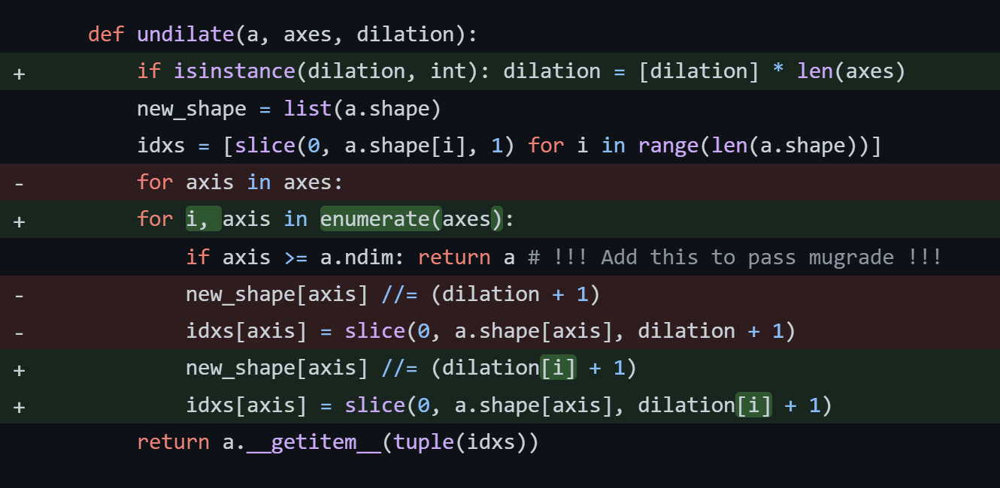
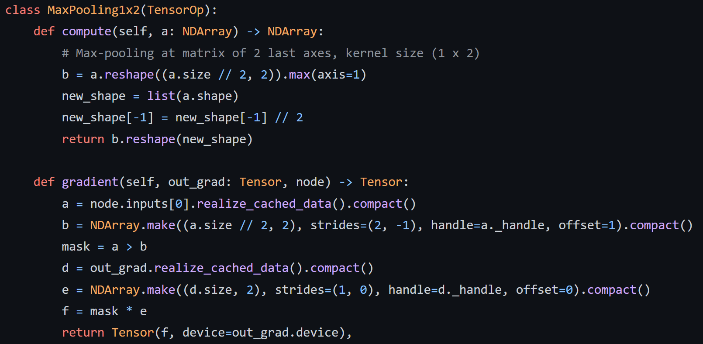
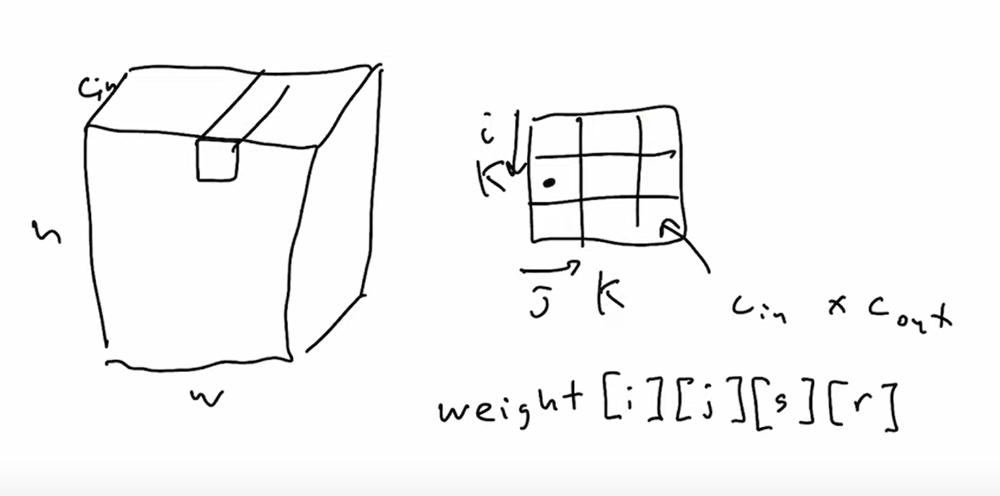
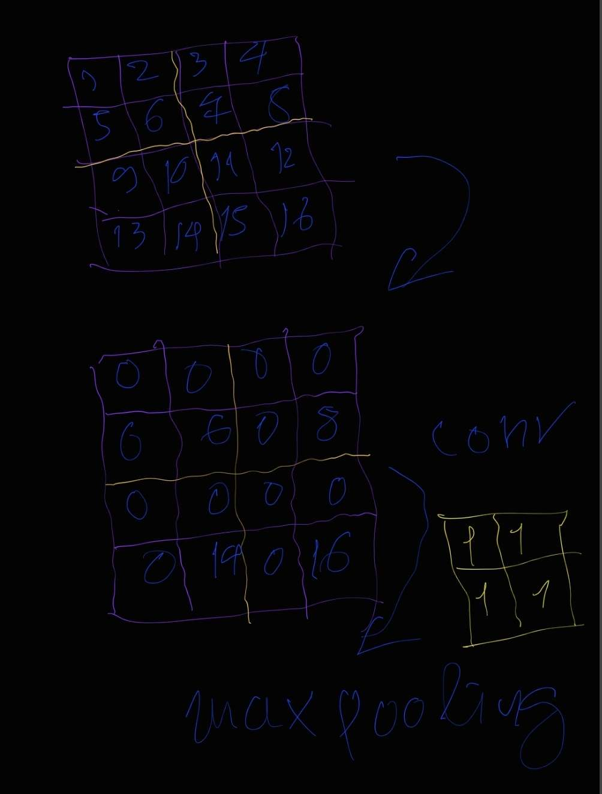

https://dlsyscourse.org/project

a recording of a slideshow with voiceover,
a screen-capture of the system you’ve built,
no more than 90 seconds.

Your project will be graded primarily on how well you are able to extend the ideas presented in class to build an interesting and useful extension of the methods we have covered. Your project will be graded based both upon your prose and code, so the code should be written in a legible manner meant to be read, with appropriate structure and comments, etc.

## Video report

I did some works for A/ diff (w,h) kernel for convolution and B/ max-pooling-2x1 and here is what I want to summary:

A/ https://gist.github.com/tiendung/1f8fc03707da89139ad1508f2ca262dd

To support different (w, h) kernel for convolution we need to modify related ops/functions to support that difference.
The first ops need to modify is `dilate/undilate` to support different dilation over selected axes.

[[ we can show a screenshot of diff code to illustrate]]


...

B/ https://gist.github.com/tiendung/79579e8b248975c59980ff001ba6c109

For max-pooling, we should write a new NDArray function to do it efficiently. But since for this project we need to do 2x1 max-pooling only, we can apply some stride tricks to complete the function without writing new C++ code.



## Final report


## [Conv as matmul](https://youtu.be/7kclgMIcMq0?t=1581)

https://github.com/telexyz/kim/blob/master/notebooks/convolution_implementation.ipynb



Ảnh đầu vào có kích cỡ h x w, và có c_in channels (kênh màu)
Với mỗi c_out channel `r` ta có c_in conv filters/kernels kích cỡ (k x k)

Trường hợp đơn giản nhất k = 1, với mỗi `r` filters giờ chỉ là 1 vector
Và toàn bộ filters là một ma trận kích cỡ (c_in, c_out). Khi đó:

conv(input_image) = 
(n, h, w, c_in) @ (c_in, c_out)
(n * h * w, c_in) @ (c_in, c_out) = 
(n * h * w, c_out) =
(n, h, w, c_cout) =
output_image

Với n là batch_size, (h, w) là kích thước ảnh, 
c_in là số channels của input image, c_out là số channels của output_image

Code mẫu cho thao tác trên:
```py
import torch
import torch.nn as nn
import numpy as np

def conv_reference(Z, weight):
    Z_torch = torch.tensor(Z).permute(0,3,1,2) # NHWC -> NCHW 
    W_torch = torch.tensor(weight).permute(3,2,0,1) # KKIO -> OIKK
    out = nn.functional.conv2d(Z_torch, W_torch) # run convolution
    return out.permute(0,2,3,1).contiguous().numpy() # NCHW -> NHWC

Z = np.random.randn(10,32,32,8)
W = np.random.randn(3,3,8,16)
out = conv_reference(Z,W)
print(out.shape) # (10, 30, 30, 16)

W1 = np.random.randn(1,1,8,16) # 1x1 kernel size
out = conv_reference(Z,W1) # (10, 32, 32, 16)

out2 = Z @ W1[0,0] # với 1x1 kernels, conv tương đương với 1 phép nhân ma trận
print(np.linalg.norm(out - out2))
```

Cải tiến dễ thấy tiếp theo là ta chạy từng cạnh i, j của kernel và sử dụng matmul với 1x1 kernel rồi cộng tổng của chúng lại:
```py
def conv_matmul(Z, weight):
    N,H,W,C_in = Z.shape
    K,_,_,C_out = weight.shape
    out = np.zeros((N,H-K+1,W-K+1,C_out))
    
    for i in range(K):
        for j in range(K):
            out += Z[:,i:i+H-K+1,j:j+W-K+1,:] @ weight[i,j]
    return out

out = conv_reference(Z,W)
out2 = conv_matmul(Z,W)
```
## (h, w) kernel implementation
https://gist.github.com/tiendung/1f8fc03707da89139ad1508f2ca262dd

## 2x1 max-pooling
https://gist.github.com/tiendung/79579e8b248975c59980ff001ba6c109

## 2x1 max-pool trick
```py
import kim
a = kim.default_device().rand(3, 3, 5, 4)
b = kim.NDArray.make((a.size // 2, 2), strides=(2,-1), handle=a._handle, offset=a._offset + 1)
c = (b < a) * a
new_shape = list(a.shape)
new_shape[-1] = new_shape[-1] // 2
d = c.max(axis=1).reshape(new_shape)
# mask = (a > b)
# a * mask
```

### Very first max-pool trick idea



