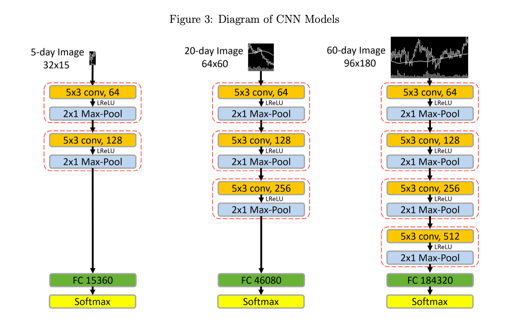

## (h, w) kernel implementation
https://gist.github.com/tiendung/1f8fc03707da89139ad1508f2ca262dd

## pytorch max-pooling
https://pytorch.org/docs/stable/generated/torch.nn.MaxPool2d.html

## 2x1 max-pool trick

```py
import kim
a = kim.default_device().rand(3, 3, 5, 4)
b = kim.NDArray.make((a.size // 2, 2), strides=(2,-1), handle=a._handle, offset=a._offset + 1)
c = (b < a) * a
new_shape = list(a.shape)
new_shape[-1] = new_shape[-1] // 2
d = c.max(axis=1).reshape(new_shape)
# mask = (a > b)
# a * mask
```


