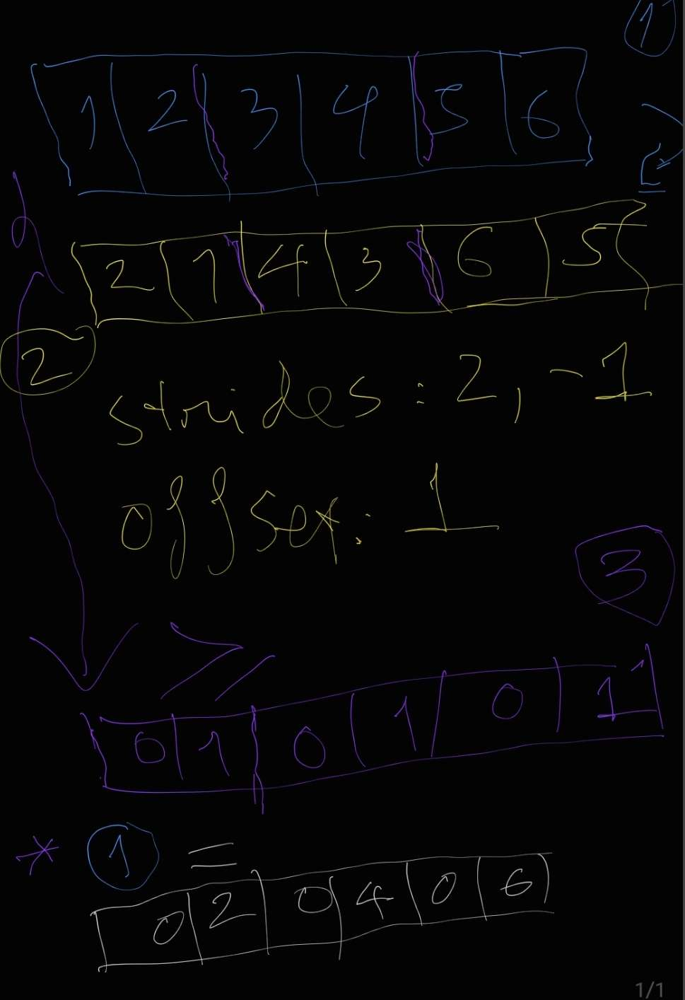

## pytorch max-pooling
https://pytorch.org/docs/stable/generated/torch.nn.MaxPool2d.html

## 2x1 max-pool trick

```py
import kim as ndl

a = ndl.default_device().rand(5,2)
b = ndl.NDArray.make(a.shape, strides=(2,-1), handle=a._handle, offset=1).compact()
mask = (a > b)
a * mask
```





- - -

More Advanced Model
https://towardsdatascience.com/block-recurrent-transformer-lstm-and-transformer-combined-ec3e64af971a