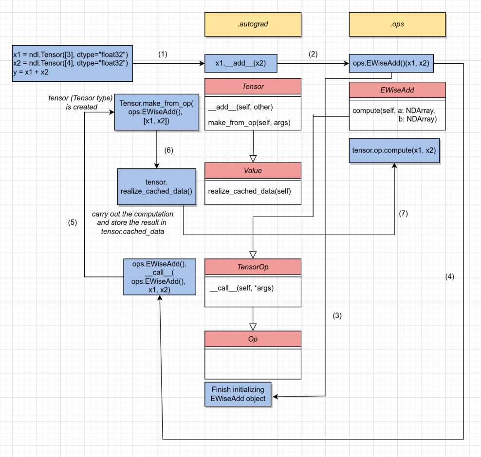
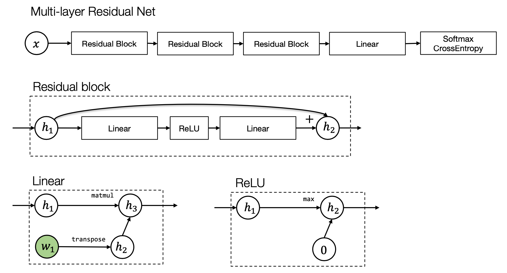

Thư viện học sâu triển khai theo khóa học https://dlsyscourse.org

## AutoDiff và đồ thị tính toán

- **kim/autograd.py** thư viện chính xây dựng nên đồ thị tính toán, cách tính `forward`, `backward`

- **kim/ops.py** các thao tác trên `Tensor`, gồm hàm `compute` để tính toán giá trị forward, và `gradient` để tính toán giá trị backward.

*Sơ đồ gọi các hàm trong Tensor forward (Value và Op có thể bỏ qua)*

## Thư viện mạng nơ-ron

- **kim/init.py** khởi tạo các tham số

- **kim/data.py** tải và tiền xử lý dữ liệu

- **kim/optim.py** các phương pháp tối ưu hóa

- **kim/nn.py** các modules xây dựng nên mạng nơ-ron

## Các modules của mạng nơ-ron

*Kiến trúc của một mạng nơ-ron (multi-layer residual)*

Note: hình tròn là tensor, hình chữ nhật là module. Module đơn vị được cấu thành từ các tensors và các phép toán trên tensors. Các module kết hợp với nhau tạo nên module mức cao hơn (phức tạp hơn).