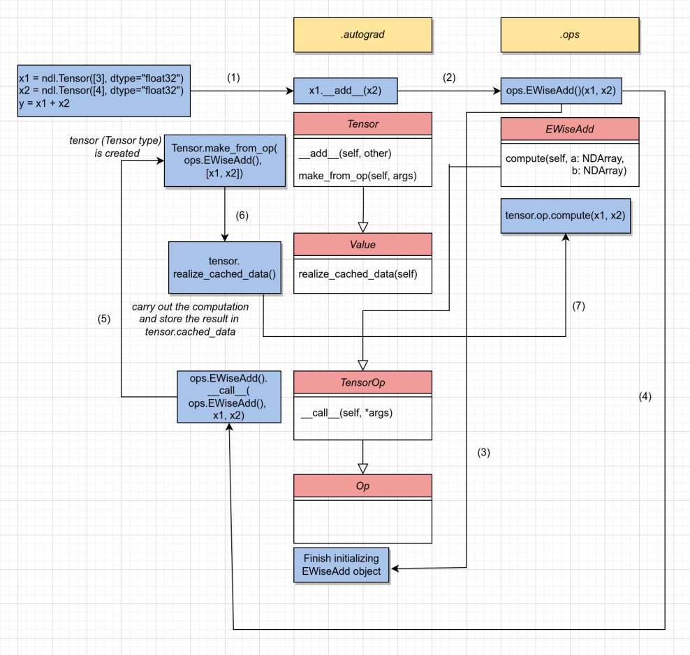

Thư viện học sâu triển khai theo khóa học https://dlsyscourse.org

- **kim/autograd.py** thư viện chính xây dựng nên đồ thị tính toán, và các thao tác tính toán `forward`, `backward` trên đồ thị tiénh toán

- **kim/ops.py** các thao tác trên `Tensor`, gồm hàm `compute` để tính toán giá trị forward, và `gradient` để tính toán giá trị backward.

*Sơ đồ gọi các hàm trong Tensor forward (Value và Op có thể bỏ qua)*