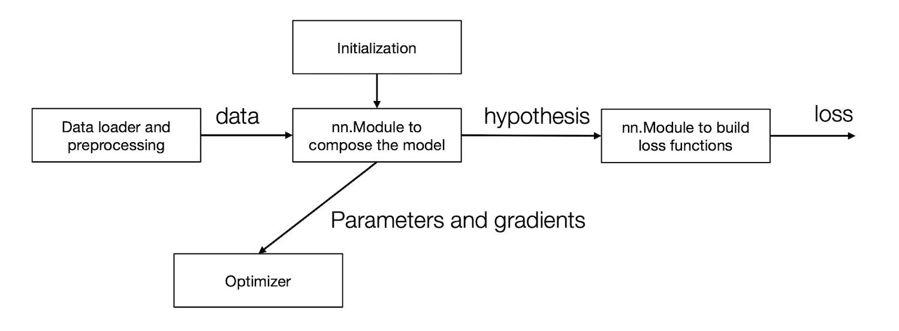

Thư viện học sâu triển khai theo khóa học https://dlsyscourse.org

## AutoDiff và đồ thị tính toán

- **kim/autograd.py** thư viện chính xây dựng nên đồ thị tính toán, cách tính `forward`, `backward`

- **kim/ops.py** các thao tác trên `Tensor`, gồm hàm `compute` để tính toán giá trị forward, và `gradient` để tính toán giá trị backward.

*Sơ đồ gọi các hàm trong Tensor forward (Value và Op có thể bỏ qua)*

## Thư viện mạng nơ-ron

- **kim/init.py** khởi tạo các tham số

- **kim/data.py** tải và tiền xử lý dữ liệu

- **kim/optim.py** các phương pháp tối ưu hóa

- **kim/nn.py** các modules xây dựng nên mạng nơ-ron

## Các modules của mạng nơ-ron

