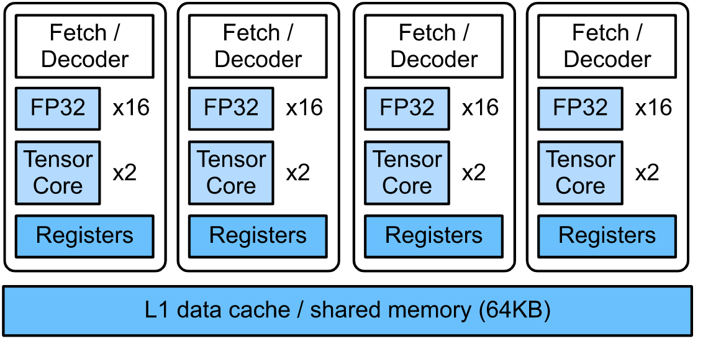

https://github.com/kevinzakka/learn-cuda/blob/master/warps.md


## Tesla T4's SM (Streaming Multiprocessor)

https://colab.research.google.com/github/d2l-ai/d2l-tvm-colab/blob/master/chapter_gpu_schedules/arch.ipynb



- - -

https://en.wikipedia.org/wiki/Parallel_Thread_Execution

```nvptx
.reg .u32 %r<335>; 			// declare 335 registers %r0, %r1, ..., %r334 of type unsigned 32-bit integer

shr.u64 %rd14, %rd12, 32;   // shift right an unsigned 64-bit integer from %rd12 by 32 positions, result in %rd14

cvt.u64.u32 %rd142, %r112;  // convert an unsigned 32-bit integer to 64-bit

```
- - -

https://developer.nvidia.com/blog/cuda-refresher-cuda-programming-model

A100: 256KB Registers, 192KB SMEM

