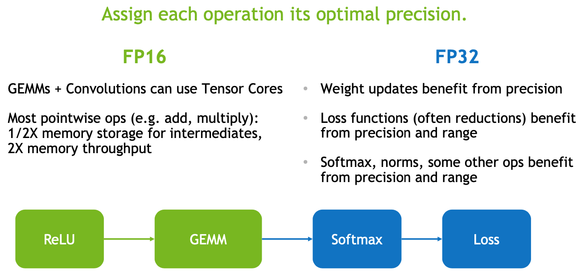

## mixed-precision_AMP-Pytorch.pdf

- - -

https://stackoverflow.com/questions/71980837/cuda-tensor-cores-what-is-the-effect-of-numblocks-and-threadsperblock

https://docs.nvidia.com/cuda/cuda-c-programming-guide/index.html#wmma

## Mixed Precision

https://github.com/NVIDIA/apex

https://towardsdatascience.com/understanding-mixed-precision-training-4b246679c7c4

Mixed precision training converts the weights to FP16 and calculates the gradients, before converting them back to FP32 before multiplying by the learning rate and updating the weights in the optimizer.

Here, we can see the benefit of keeping the FP32 copy of the weights. As the learning rate is often small, when multiplied by the weight gradients they can often be tiny values. For FP16, any number with magnitude smaller than 2^(-24) will be equated to zero as it cannot be represented (this is the denormalized limit for FP16). Therefore, by completing the updates in FP32, these update values can be preserved.

The use of both FP16 and FP32 is the reason this technique is called mixed-precision training.

### Automatic Mixed Precision

In 2018, NVIDIA released an extension for PyTorch called Apex, which contained AMP (Automatic Mixed Precision) capability. This provided a streamlined solution for using mixed-precision training in PyTorch.

In only a few lines of code, training could be moved from FP32 to mixed precision on the GPU. This had two key benefits:

Reduced training time — training time was shown to be reduced by anywhere between 1.5x and 5.5x, with no significant reduction in model performance.

Reduced memory requirements — this freed up memory to increase other model elements, such as architecture size, batch size and input data size.
