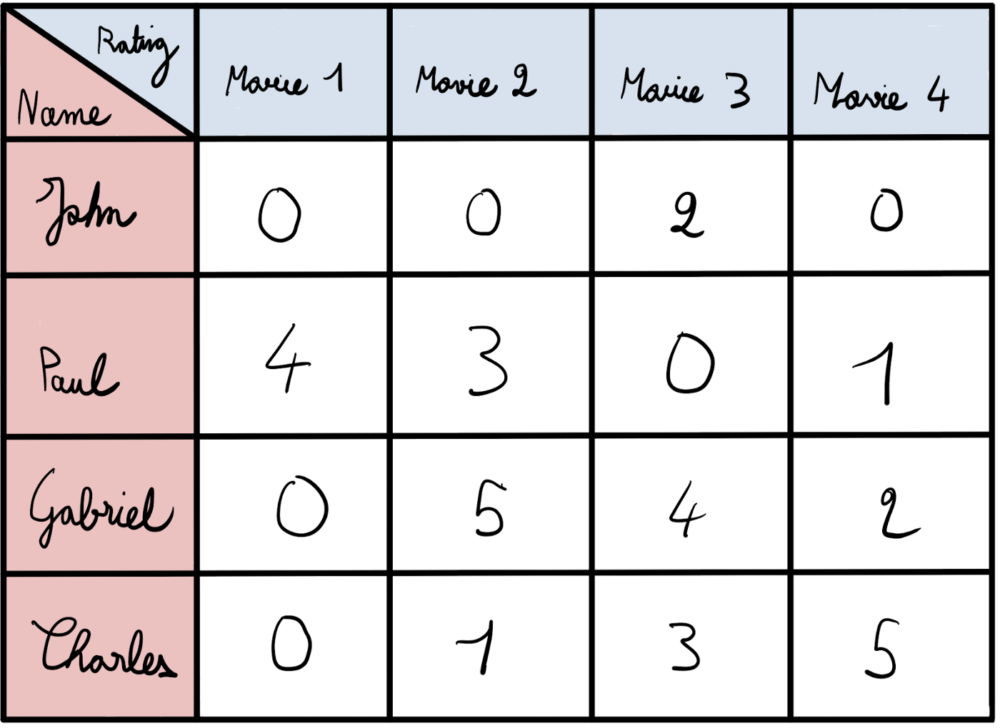
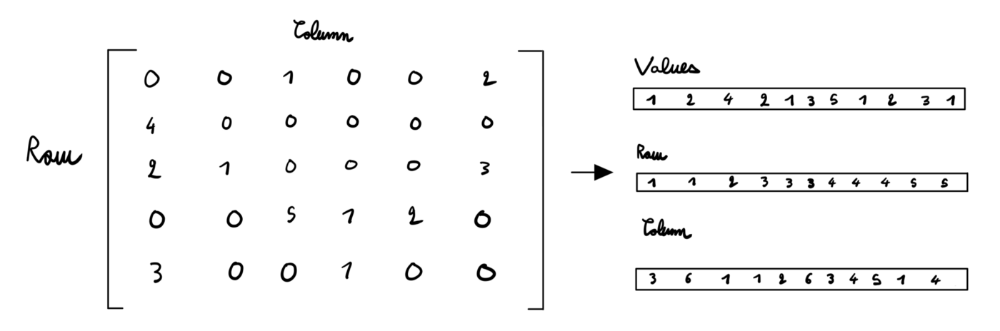

Sparsity in Deep Learning: Pruning + growth for efficient inference and training in neural networks

https://www.youtube.com/watch?v=H7-p3OWPpEI

- - -

https://www.reddit.com/r/MachineLearning/comments/j2m1qr/r_sparse_gpu_kernels_for_deep_learning/

=> https://github.com/google-research/sputnik

- - -

https://openai.com/blog/block-sparse-gpu-kernels/

=> https://github.com/openai/blocksparse

- - -

https://miro.medium.com/max/1400/1*lqHmmV_01iNl6AU4RjUwsQ.png

