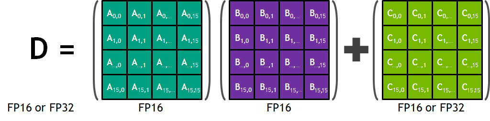

https://developer.nvidia.com/blog/programming-tensor-cores-cuda-9/#attachment_8495

hile cuBLAS and cuDNN cover many of the potential uses for Tensor Cores, you can also program them directly in CUDA C++. Tensor Cores are exposed in CUDA 9.0 via a set of functions and types in the nvcuda::wmma namespace. These allow you to load or initialize values into the special format required by the tensor cores, perform matrix multiply-accumulate (MMA) steps, and store values back out to memory. During program execution multiple Tensor Cores are used concurrently by a full warp. This allows the warp to perform a 16x16x16 MMA at very high throughput (Figure 5).



https://pytorch.org/tutorials/recipes/recipes/amp_recipe.html

https://docs.nvidia.com/cuda/cuda-c-programming-guide/index.html#wmma
```c
#include <mma.h>
using namespace nvcuda;

__global__ void wmma_ker(half *a, half *b, float *c) {
   // Declare the fragments
   wmma::fragment<wmma::matrix_a, 16, 16, 16, half, wmma::col_major> a_frag;
   wmma::fragment<wmma::matrix_b, 16, 16, 16, half, wmma::row_major> b_frag;
   wmma::fragment<wmma::accumulator, 16, 16, 16, float> c_frag;

   // Initialize the output to zero
   wmma::fill_fragment(c_frag, 0.0f);

   // Load the inputs
   wmma::load_matrix_sync(a_frag, a, 16);
   wmma::load_matrix_sync(b_frag, b, 16);

   // Perform the matrix multiplication
   wmma::mma_sync(c_frag, a_frag, b_frag, c_frag);

   // Store the output
   wmma::store_matrix_sync(c, c_frag, 16, wmma::mem_row_major);
}
```

https://docs.nvidia.com/cuda/cuda-c-programming-guide/index.html#dpx
DPX is a set of functions that enable finding min and max values, as well as fused addition and min/max, for up to three 16 and 32-bit signed or unsigned integer parameters, with optional ReLU (clamping to zero):

