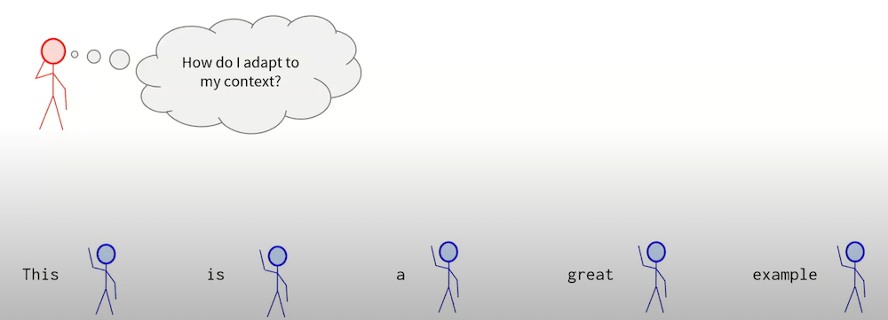

# Transformer implementation

11785 https://www.youtube.com/watch?v=X2nUH6fXfbc
10714 https://www.youtube.com/watch?v=OzFmKdAHJn0

- - -

# Attention and Transformer

https://youtu.be/amqFoES3c1w?t=663

## Q, K, V in Attention

Database Analogy
- Q(uery) is query you typed in to get the data
- K(eys) point to where information is
- V(alues) are information itself

=>

- `Query` is what **pays attention**: what looking for where I get information from?
- `Values` are what are **paid attention to**
- `Keys` helps queries figure out **how much attention to pay** to each value

- `Attention Weights` how much attention to pay

The red guy is the current token, it wonders how do i adapt to my context? And all the bule guys are there to help. They said "hey, this is me, here is my information!"

The red guy goal is to get a contextualized representation. And the guy think: "may be I can do a weighted sum? May be I can use all of this information and do a weighted some to get my contextualized representation."

Use enery function $e_ij =  q_i^T k_j$, then softmax to normalize 

`Query` is the guy are wondering "How do I contextualize my own represention?".
`Keys` are all other guys. They said here is my information, try to use it to contextualize your represention!

What we use to multiple with attenion weights are called `Values`. The weighted sum to get contextualized representation.

`h` is a vector representation of token, it can be one-hot or anything ...
W_Q, W_K, W_V are just matrix to do linear projection to other dimentions.

We take one query, one key and calculate energy score or one attention score. And do 
the same for other keys. And get scores for each of (key) tokens. We pass everything to the softmax. And we have `attention weights`.

> `attention weight` $alpha_m,n$ is how important token n to token m's contextual meaning?

Now we take all of the `values` (h @ W_v), multiple them with each of attention weights that we found, take a weighted some to get the output o (contextualized representation).

## Scaled-dot attention
https://youtu.be/amqFoES3c1w?t=1054

Scaled mean divide by dimensionality of the keys. This is done before we do softmax. 
Why we do it? => To keep values numberically stable (not too extreme ...)

dot product are enery function, the function we use to score each of the key using a query.

3 is dimensionality of the key.

## Self-attention

## Attention is all we need

