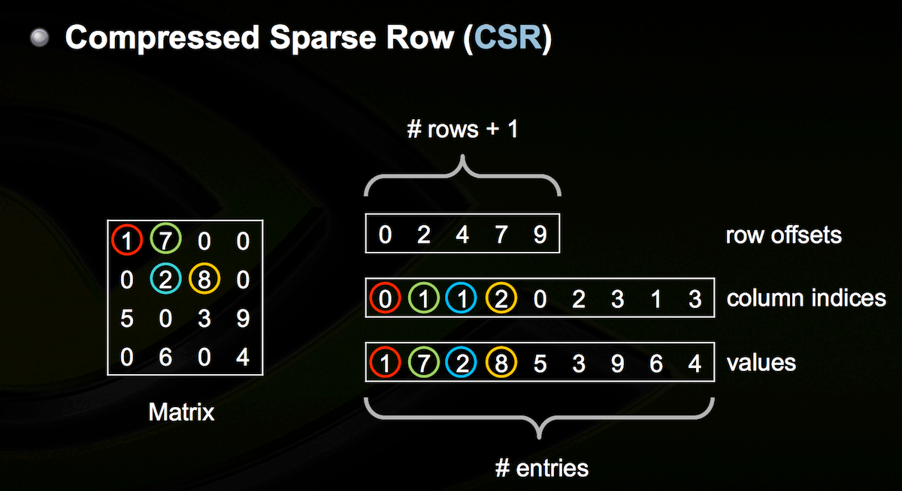

https://leimao.github.io/blog/CSR-Sparse-Matrix-Multiplication

Image from https://dziganto.github.io/Sparse-Matrices-For-Efficient-Machine-Learning

row offsets or row ptr is number of non-zero accumulated until this row.

Advantages
- Efficient arithmetic operations CSR + CSR, CSR × CSR, etc.
- Efficient row slicing.
- Fast matrix vector products.

Disadvantages
- Slow column slicing operations.
- Changes to the sparsity structure are expensive.

## CSR Matrix Multiplication

- - -

## Others

[Representation and Efficient Computation of Sparse Matrix for Neural Networks](https://www.diva-portal.org/smash/get/diva2:1634980/FULLTEXT01.pdf)

### 2.5.3 Block Compressed Sparse Row Format

