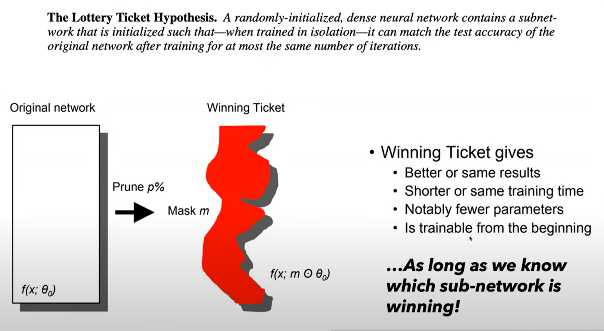
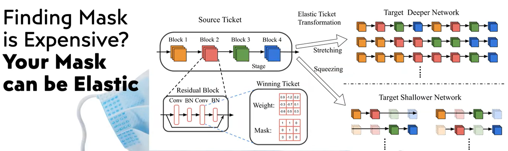
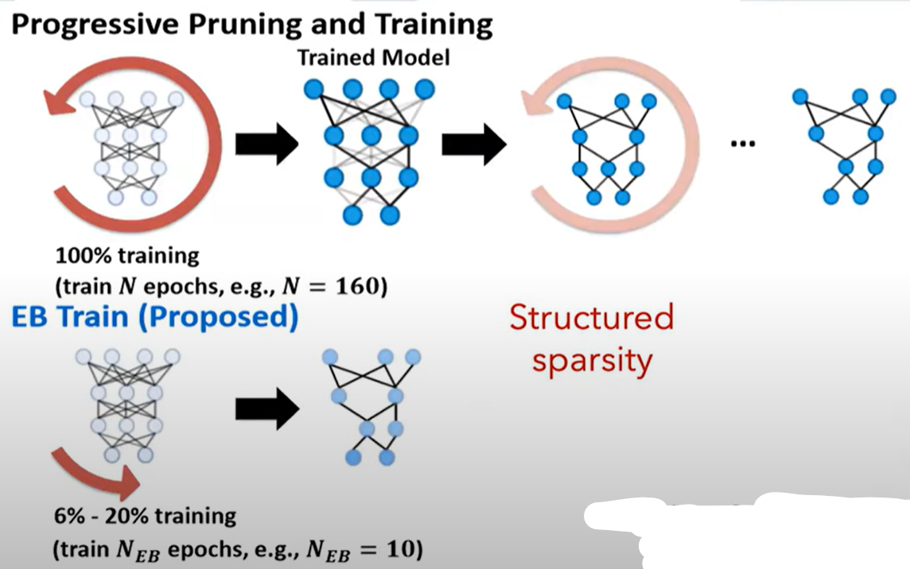
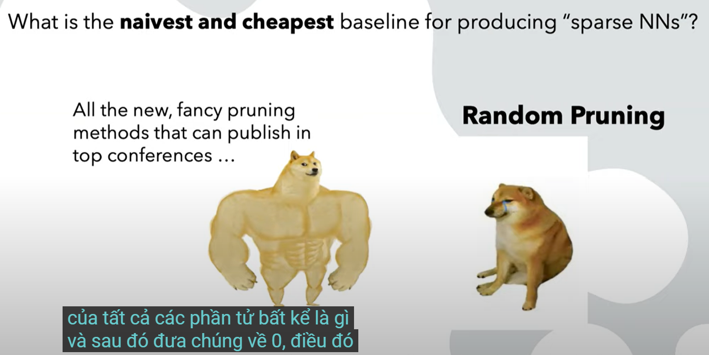

__Abstract__: A sparse neural network (NN) has most of its parameters set to zero and is traditionally considered as the product of NN compression (i.e., pruning). Yet recently, sparsity has exposed itself as an important bridge for modeling the underlying low dimensionality of NNs, for understanding their generalization, optimization dynamics, implicit regularization, expressivity, and robustness. Deep NNs learned with sparsity-aware priors have also demonstrated significantly improved performances through a full stack of applied work on algorithms, systems, and hardware. In this talk, I plan to cover some of our recent progress on the practical,  theoretical, and scientific aspects of sparse NNs. I will try scratching the surface of three aspects: (1) practically, why one should love a sparse NN, beyond just a post-training NN compression tool; (2) theoretically, what are some guarantees that one can expect from sparse NNs; and (3) what is future prospect of exploiting sparsity.

Mạng nơ-ron thưa có phần lớn các tham số là 0 thường được coi là một sản phẩm của việc nén mạng nơ-ron (ví dụ cắt tỉa - pruning). Gần đây, tính thưa thớt đã tự thể hiện mình như một cầu nối quan trọng để mô hình hóa phần thấp chiều cơ bản của NN, để hiểu được tính khái quát hóa, động lực tối ưu hóa, chính quy hóa ngầm định, tính biểu cảm và tính mạnh mẽ của chúng. Các NN sâu được học với các tiền thân nhận thức được độ thưa thớt cũng đã chứng minh hiệu suất được cải thiện đáng kể thông qua một loạt công việc ứng dụng đầy đủ trên các thuật toán, hệ thống và phần cứng.

Trong buổi nói chuyện này, tôi dự định đề cập đến một số tiến bộ gần đây của chúng tôi về các khía cạnh thực tiễn, lý thuyết và khoa học của các mạng NN thưa thớt. Tôi sẽ cố gắng tìm hiểu sơ qua ba khía cạnh: 
1. trên thực tế, tại sao người ta nên yêu thích một NN thưa thớt, hơn cả công cụ nén NN sau đào tạo
2. về mặt lý thuyết, một số đảm bảo mà người ta có thể mong đợi từ các NN thưa thớt là gì; và
3. triển vọng khai thác thưa thớt trong tương lai là gì.

- - -

## Lottery Ticket Hypothesis https://youtu.be/E_jpEUul5W8?t=717

Thay vì đào tạo một mạng to béo ban đầu, có thể có một phiên bản thu gọn (màu đỏ), và khi nói về thu gọn, nó có thể là 90%, 95%, hoặc 97% các phần tử là 0. Và khi bạn đào tạo mạng nơ-ron cực kỳ mỏng này từ đầu sử dụng các bước huấn luyện tương tự bạn sẽ nhận được hiệu suất như mạng nơ-ron ban đầu. Nghe có vẻ may mắn :D Đúng vậy, điều đó sẽ mang lại hiệu suất tốt hơn, chạy nhanh hơn, cùng thời gian đào tạo ngắn hơn ... Nghe có vẻ tất cả đều tuyệt vời, tuy nhiên bạn THỰC SỰ phải biết mạng con nào đã trúng sổ xố. Nghĩa là bạn thực sự hiểu rõ về mạng nơ-ron thưa.

Thuyết xổ số này không phải là một bằng chứng là sẽ tồn tại một mạng con như vậy, mà nó là một phỏng đoán, một giả thiết mà nhiều người không nói cho bạn biết làm thế nào để tìm ra mạng con đó (trúng xổ số).

May mắn là Jonathan và Michael cung cấp một cách xây dựng đặc biệt có thể tìm ra giải pháp, để họ có thể khẳng định giả thiết này là đúng về mặt THỰC NGHIỆM!

Hãy xem xét phương pháp họ nêu ra đó là Cắt tỉa cường độ lặp lại (iterative magnitude pruning) gồm 4 bước như sau:
- a) Khởi tạo ngẫu nhiên một mạng đặc
- b) Huấn luyện nó như bình thường và cắt tỉa những trọng số không quan trọng
- c) Cài đặt lại những trọng số còn lại theo giá trị đã được khởi tạo ở bước a) một cách chính xác
- d) Lặp lại các bước b) và c)

Bước b) là cách cắt tỉa truyền thống, không có gì mới lạ ở đây. 
Bước c) ta chỉ giữ lại tính kết nối của mạng sau khi cắt tỉa chứ không quan tâm tới giá trị trọng số đã qua huấn luyện.
Nói cách khác bước b) + c) là để xác định xem nhưng kết nối nào là thực sự quan trọng trong một mô hình mạng nơ-ron với tập huấn luyện.

Tiếp tục lặp lại quá trình này cho tới khi cấu trúc mạng hội tụ tới một điều kiện cho trước (lặp đi lặp lại việc loại bỏ một vài phần tử có giá trị nhỏ - sức ảnh hưởng ko đáng kể - cho tới khi bạn hài lòng với độ thưa).

Kết quả cuối cùng là tấm vé số chúng ta kiếm tìm. Nó bao gồm 2 phần:
- Mặt nạ thể hiện độ thưa thớt
- Khởi tạo ban đầu (bạn đã thực hiện ở bước a)

Khi lần đầu tiên nhìn thấy thuật toán này tôi thấy nó thật ngớ ngẩn, bởi vì tôi đang cố gắng tạo ra một mạng thưa để có thể huấn luyện nó một cách hiệu quả, nhưng thực tế thì để tạo ra một mạng thưa như vậy tôi phải đào tạo đi đào tạo lại mạng đó rất nhiều lần để có thể có được tấm vé trúng thưởng. Vậy tại sao tôi phải tốn công đến như vậy ??? Note: Việc đào tạo ở đây là đào tạo tới bước cuối cùng (hội tụ).

Rõ ràng là việc tìm ra mặt nạ thưa thớt này là đắt đỏ và thuật toán này không có nhiều giá trị, ngoài việc cung cấp một bằng chứng tồn tại cho tấm vé số trúng thưởng. Tất cả các điều trên chỉ để kết luận rằng:
- Tấm vé trúng thưởng có tồn tại
- Và có một cách rất đắt đỏ để tìm ra nó.

- - -

Khi đọc được bài báo đó, tôi đã quay lại và nói với nhóm của tôi rằng, chúng ta sẽ tìm được giải pháp tìm ra tấm vé số trúng thưởng một cách ít tốn kém, và vài năm sau, chúng tôi đã làm được điều đó !!!

__Nếu việc tìm ra mặt nào là tốn kém thì tại sao không sử dụng một mặt nạ đã được tạo ra từ trước?__

Từ khóa đầu tiên là `sử dụng lại`: chúng ta có thể tìm thấy một mặt nạ thưa thớt tốt trên một mô hình đã được đào tạo từ trước, mà mặt nạ đó có thể được chuyển (transfer learning) sang một mô hình / tập dữ liệu khác. Điều này khiến cho mô hình được huấn luyện trước (pre-training models) trở nên nhẹ hơn rất nhiều. Ví dụ với Bert ta có thể giảm tới 80,90% kích thước mạng mà không làm ảnh hưởng tới hiệu suất của mô hình.

Vậy từ khóa đầu tiên là `sử dụng lại` và kỹ thuật đằng sau nó là huấn luyện trước và học chuyển giao (pre-training and transfer learning).

- - -

Từ khóa tiếp theo `mặt nạ có tính co giãn`: chúng ta có thể chuyển hóa tấm vé trúng thưởng từ một mạng này sang một mạng khác có cùng kiến trúc, để trực tiếp tìm ra chiếc vé trúng thưởng của mạng mới mà không phải thực hiện lại quá trình tìm kiếm đắt đỏ.

- - -

# EarlyBERT: Efficient BERT Training via Early-bird Lottery Tickets

https://github.com/VITA-Group/EarlyBERT |
https://youtu.be/E_jpEUul5W8?t=1747

__ngạc nhiên là độ thưa thớt tốt có thể dễ dàng được tìm ra__

Khoảng 15-20% của tổng số lượng epochs, các kết nối quan trọng đã nổi lên và được giữ cho ổn định. Vì thế việc cắt tỉa có thể diễn ra từ sớm.

- - -

## Câu truyện thứ 3

Tổng kết lại, bạn đã biết tấm vé trúng thưởng là có thật, và có thể tìm ra được, có thể được chuyển giao (pre-trainling / transfer learning), và có thể phát hiện sớm (EarlyBERT), và tôi tiếp tục gợi ý rằng thực sự tồn tại một người đặc biệt may mắn và việc trả giá để rút được tấm vé đó là hoàn toàn xứng đáng. Tôi sẽ kể cho bạn một câu truyện khác rằng bạn có thể không cần phải trả thuế để tìm ra tấm vé số đó.

Việc cắt tỉa ngẫu nhiên là rác rưởi? Không hẳn như vậy, nếu huấn luyện NN từ đầu thì cắt tỉa ngẫu nhiên có thể tốt! Thậm chí rất mạnh mẽ.

Hãy sử dụng một mặt nạ thưa miễn phí bằng cách cắt tỉa ngẫu nhiên, bắt đầu từ đó để có thể có được mặt nạ đủ tốt, tốt như là các phương pháp khác !?!

Chúng tôi đã làm rất nhiều thực nghiệm và phát hiện ra rằng: khi mạng nơ-ron đặc lúc đầu trở nên rộng hơn và sâu hơn thì việc huấn luyện một mạng cắt tỉa ngẫu nhiên đạt độ hiệu quả tương xứng với mạng đặc ban đầu, nó cũng đạt độ hiệu quả ngang với các phương pháp cắt tỉa khác, thậm chí với tỉ lệ cắt tỉa cao.

Phát hiện đầu tiên là: bạn cần một mô hình đủ sâu và đủ rộng để cắt tỉa ngẫu nhiên thực sự hiệu quả !!!

Phát hiện thứ hai: để cắt tỉa ngẫu nhiên hoạt động hiệu quả, thì tỉ lệ thưa thớt của từng layer có thể được cấu hình từ trước. Có vẻ như việc phân bổ tài nguyên (độ thưa thớt) giữa các layers quyết định luồng gradient. Trên thực tế, một số phương pháp cắt tỉa nâng cao đều quan tâm tới việc phân bổ tài nguyên này: Nếu layer này rộng ta sẽ gán cho nó độ cắt tải cao hơn, nếu layer này hẹp thì ta phân bố tỉ lệ cắt tỉa thất hơn.

Kết quả là: một mạng cắt tỉa ngẫu nhiên của một Wide Resnet-50 có thể được huấn luyện thưa thớt để đạt tới độ chính xác của một mạng Wide Resnet-50 đặc, trên tập dữ liệu ImageNet.

Nhắc lại, cắt tỉa ngẫu nhiên chỉ hiệu quả với một mạng đủ rộng và nó đạt độ chính xác tương đương với mạng đặc rộng đó, tức là độ chính xác của mạng thưa được cắt tỉa ngẫu nhiên này vượt qua độ chính xác của một mạng đặc nhỏ hơn có cùng số lượng tham số.

- - -

## More good things https://youtu.be/E_jpEUul5W8?t=2410

 