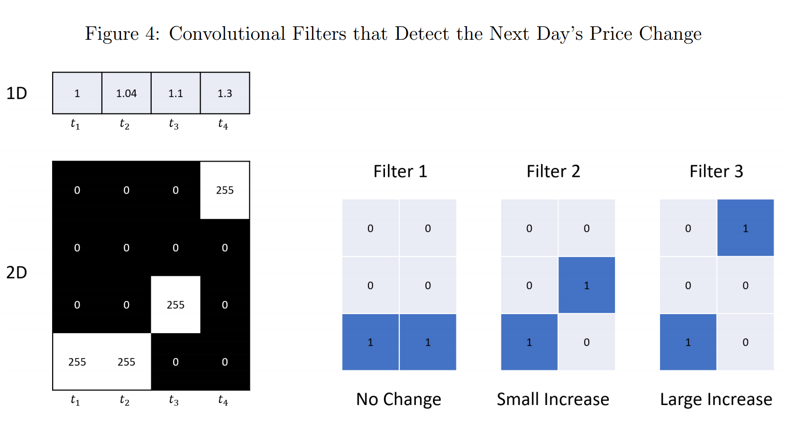

Paper https://ssrn.com/abstract=3756587

Our empirical analysis revolves around a panel prediction model for US stock returns from 1993 to 2019. We train a panel CNN model to predict the direction (up or down) of future stock returns. That is, in each training sample, we estimate a single model with a fixed structure and set of parameters that produces forecasts for all individual stocks. The data input to this model are images depicting price and volume (daily open, close, high, and low prices, daily trading volume, and moving average price) over the past 5, 20, and 60 days. The output of the CNN is a set of stock-level estimates for the probability of a positive subsequent return over short (5-day), medium (20-day), and long (60-day) horizons. We use CNN-based out-of-sample predictions as signals in a number of asset pricing analyses.

Our main empirical finding is that __image-based CNN predictions are powerful and robust predictors__ of future returns. We summarize this predictive power in economic terms with out-of-sample portfolio performance. We sort stocks into decile portfolios using image-based CNN forecasts and track the returns of a decile spread H-L portfolio. Image-based decile spreads perform extraordinarily well, have portfolio turnover that is nearly identical to WSTR, but manage to double the annualized performance of WSTR.

__The key differentiator of our approach is that we do not require the researcher to pre-specify a set of technical patterns__. Instead, we simply present our model with historical market data in the form of an image. In place of human-generated predictive signals, our CNN conducts an automated search for image patterns that are most predictive of future returns. This is a continuation of the agenda set forth by Lo et al. (2000), but with a re-tooled research design benefitting from twenty years of progress in machine learning and computer vision. Ultimately, our CNN approach extracts robust predictive patterns from images that outperform stalwart price trend patterns from the literature, including momentum and short-term reversal.

## “Imaging” Market Data

- `015360/128=120` pixels per channel
- `046080/256=180` pixels per channel
- `184320/512=360` pixels per channel

## Image Representation vs. Time-series Representation

- 1D t1, t2, t3, t4 là time series prices
- 2D B&W image là thể hiện rời rạc của 1D time series, 255/điểm ảnh trắng tương đương với price, 0 điểm ảnh đen tương đương với khoảng trống trong ảnh.

For illustration, each unit on the y-axis of the image is 0.1. Because the difference between 1.04 and 1.0 is smaller than 0.05, the discretized prices on the image are flat over the first two periods. The figure on the right demonstrates three 3 × 2 convolutional filters that detect no change, small increase, and large increase in price, respectively.

## Training the CNN

Our workflow from training, to model tuning, and finally to prediction follows the basic procedure outlined by Gu et al. (2020). First, we divide the entire sample into training, validation, and testing samples. In our main US data sample, we estimate and validate the model using a single eight-year sample (1993-2000) at the start of our sample. In this eight-year sample, we randomly select __70% images for training and 30% for validation__.

Randomly selecting the training and validation sample helps balance positive and negative labels in our classification problem, which attenuates a potential bias in classification due to extended periods of bullish or bearish market swings. The resulting training and validation images have approximately 50% up and 50% down labels in all scenarios we consider. The remaining nineteen years (2001-2019) of data comprise the out-of-sample test data set.

We treat the prediction analysis as a classification problem. In particular, the label for an image is defined as y = 1 if the subsequent return is positive and y = 0 otherwise. The training step minimizes the standard objective function for classification problems, a cross-entropy loss function. It is defined as: `L(y, yˆ) = −y log(yˆ) − (1 − y) log(1 − yˆ)` where yˆ is the softmax output from the final step in the CNN. If the predicted probability exactly corresponds with the label, yˆ = y, then the loss function is zero, otherwise the loss is positive.

- We adopt the same regularization procedures in Gu et al. (2020) to combat overfit and aid efficient computation.

- We apply the Xavier initializer for weights in each layer (Glorot and Bengio, 2010). This promotes faster convergence by generating starting values for weights to ensure that prediction variance begins on a comparable scale to that of the labels.

- Loss function optimization uses stochastic gradient descent and the Adam algorithm (Kinga and Adam, 2015) with initial __learning rate of 1 × 10^−5__ and __batch size of 128__. 

- We use a batch normalization (Ioffe and Szegedy, 2015) layer between the convolution and non-linear activation within each building block to reduce covariate shift.

- We apply 50% dropout (Srivastava et al., 2014) to the fully connected layer (the relatively low parameterization in convolutional blocks avoids the need for dropout there). 

- Finally, we use early stopping to halt training once the validation sample loss function fails to improve for two consecutive epochs. Gu et al. (2020) outline the intuition behind these choices, so for the sake of brevity, we omit this discussion and instead refer interested readers there.

## Appendix: Architecture Details of the CNN

Note: This example shows that the introduction of the max-pooling layer adds robustness to noise. We take the same 6 × 6 image from the above example and blur the borderline with grey color (pixel value 122). Take Filter 1, which detects vertical edges, for example. Non-zero values from Output Channel 1 are significantly changed. However, after max-pooling is applied, the original upper-right value 765 remains intact while the original bottom-right value 510 is replaced with 632, a slightly larger number, indicating a slightly stronger signal of vertical line at the bottom than before. We observe a similar effect for Filter 2, which detects horizontal edges.

### 2D Convolution

- We use a filter size of 5×3 pixels in our baseline model.

- We use horizontal stride of one and vertical stride of three: meaning that the filter slides across the image and recalculates the filter output at every position in the row
and jumps three rows at a time as it moves down the image vertically.

- Our baseline model uses a vertical dilation of two and no horizontal dilation

### Max Pooling

The final operation in a building block is “max-pooling.” We implement this operation using a small filter that scans over the input matrix and returns the maximum value the elements entering the filter at each location in the image. The role of max-pooling is two-fold.

First, it acts as a dimension reduction device. Nearby neurons output from the convolution operation often carry similar information. If any of the neurons in the filter region are stimulated, max-pooling detects it. At the same time, it discards locally redundant information.

### specific choices for our models

- Since our images are largely sparse in the vertical dimension, we use `5 × 3` convolutional filters and `2 × 1` max-pooling filters. We use the same filter sizes in all layers for convenience. 

- We use vertical strides of `1, 3, and 3`, and vertical dilation rates of `1, 2, and 3` for 5-day, 20-day, and 60-day images, respectively, only on the first layer, where inputs are sparse raw images.

!!! Conv need to support strides > 1 and dilation > 1 !!!

- The number of CNN building blocks in our model is based on the size of the input image. We use 2 blocks to model 5-day images, 3 blocks for 20-day images and 4 blocks for 60-day images.

The number of filters for the first building block is 64 for all three models. As pointed out by Zeiler and Fergus (2014), learned features become more complex in deeper layers, so we follow the literature and increase the number of filters after each convolutional layer by a factor of two (e.g., 64, 128, 256, and 512 filters, respectively, in the four layers of the 60-day model).

In turn, the fully connected layers have 15, 360, 46, 080, and 184, 320 neurons for 5-day, 20-day, and 60-day models, respectively, which are determined by the outputs of the convolutional blocks. The total number of parameters are 155, 138 for the 5-day model, 708, 866 for 20-day, and 2, 952, 962 for 60-day models, respectively. Of course, the effective parameterization of these models is much smaller than this parameter count due to heavy regularization that shrinks most parameters close to zero.

## CNN Prediction for US Stock Returns

We use daily stock data from CRSP for all firms listed on NYSE, AMEX, and NASDAQ. Our sample runs from 1993–2019 based on the fact that daily opening, high, and low prices first become available in June 1992.

In each image, we normalize the first day closing price to one, and construct each subsequent daily close from returns (RET_t) according to p_t+1 = (1 + RET_t+1) p_t.
...