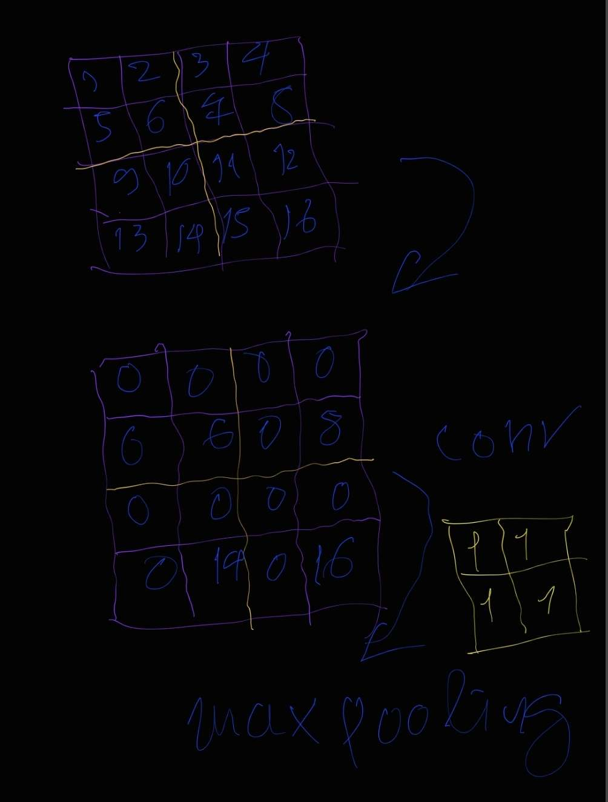
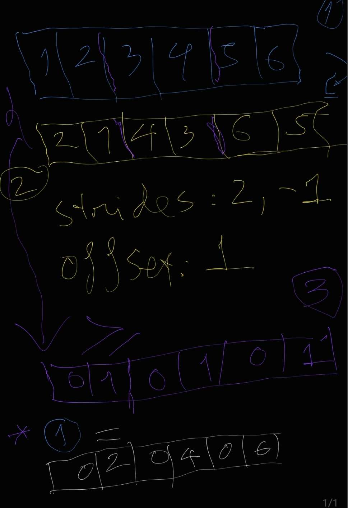

https://dlsyscourse.org/project

Your project will be graded primarily on __how well you are able to extend the ideas presented in class to build an interesting and useful extension of the methods we have covered__. Your project will be graded based both upon your prose and code, so the code should be written in a legible manner meant to be read, with appropriate structure and comments, etc.

## Input data

Download data
```
                             adjOpen    adjHigh     adjLow   adjClose  adjVolume
date
1977-01-03 00:00:00+00:00  10.580262  10.694948  10.580262  10.603927     160297
1977-01-04 00:00:00+00:00  10.603927  10.649437  10.445551  10.467396     135157
1977-01-05 00:00:00+00:00  10.467396  10.627592  10.330865  10.398220     180281
1977-01-06 00:00:00+00:00  10.398220  10.512906  10.307199  10.376375     159223
1977-01-07 00:00:00+00:00  10.376375  10.421885  10.148823  10.330865     135157
...                              ...        ...        ...        ...        ...
2022-12-15 00:00:00+00:00  15.950000  16.000000  15.460000  15.490000    1490764
2022-12-16 00:00:00+00:00  15.410000  15.650000  15.110000  15.190000    2363635
2022-12-19 00:00:00+00:00  15.250000  15.260000  13.980000  14.110000    2207664
2022-12-20 00:00:00+00:00  14.110000  14.830000  13.920000  14.710000    1974800
2022-12-21 00:00:00+00:00  14.910000  14.955000  14.730200  14.850000    1017520

[11594 rows x 5 columns]
```

conv forward
```py
inner_dim = Kw * Kh * C_in
A = A.reshape((-1, inner_dim))
out = A @ weight.reshape((inner_dim, C_out))
```

- From table data, generate B&W images
- Input: black & white images (bit: 0 vs 1), 
- 5 x 3 conv means using 15 x bits of input each conv op
- c_in = 1, c_out = 64
- `inner_dim = 15` (kh = 5, kw = 3, c_in = 1)
- ^^^^^ using 16-bit datatype (float16, uint16) is enough to store an inner_dim
- Since the width of a matrix is 15, so the optimized techniques for general matmuls won't work well

=> next conv will x128 times heavier than the first conv
=> next conv will x256 times heavier than the second conv
=> next conv will x512 times heavier than the third conv

=> Need to optimze conv in general.


## Video report
https://docs.google.com/presentation/d/1eldoC_dfDi1ukoNL2t4Bz31Swmwn7sv6u5lDqxseEo4/edit

## Final report

. . .


## [Conv as matmul](https://youtu.be/7kclgMIcMq0?t=1581)

https://github.com/telexyz/kim/blob/master/notebooks/convolution_implementation.ipynb


Ảnh đầu vào có kích cỡ h x w, và có c_in channels (kênh màu)
Với mỗi c_out channel `r` ta có c_in conv filters/kernels kích cỡ (k x k)

Trường hợp đơn giản nhất k = 1, với mỗi `r` filters giờ chỉ là 1 vector
Và toàn bộ filters là một ma trận kích cỡ (c_in, c_out). Khi đó:

conv(input_image) = 
(n, h, w, c_in) @ (c_in, c_out)
(n * h * w, c_in) @ (c_in, c_out) = 
(n * h * w, c_out) =
(n, h, w, c_cout) =
output_image

Với n là batch_size, (h, w) là kích thước ảnh, 
c_in là số channels của input image, c_out là số channels của output_image

Code mẫu cho thao tác trên:
```py
import torch
import torch.nn as nn
import numpy as np

def conv_reference(Z, weight):
    Z_torch = torch.tensor(Z).permute(0,3,1,2) # NHWC -> NCHW 
    W_torch = torch.tensor(weight).permute(3,2,0,1) # KKIO -> OIKK
    out = nn.functional.conv2d(Z_torch, W_torch) # run convolution
    return out.permute(0,2,3,1).contiguous().numpy() # NCHW -> NHWC

Z = np.random.randn(10,32,32,8)
W = np.random.randn(3,3,8,16)
out = conv_reference(Z,W)
print(out.shape) # (10, 30, 30, 16)

W1 = np.random.randn(1,1,8,16) # 1x1 kernel size
out = conv_reference(Z,W1) # (10, 32, 32, 16)

out2 = Z @ W1[0,0] # với 1x1 kernels, conv tương đương với 1 phép nhân ma trận
print(np.linalg.norm(out - out2))
```

Cải tiến dễ thấy tiếp theo là ta chạy từng cạnh i, j của kernel và sử dụng matmul với 1x1 kernel rồi cộng tổng của chúng lại:
```py
def conv_matmul(Z, weight):
    N,H,W,C_in = Z.shape
    K,_,_,C_out = weight.shape
    out = np.zeros((N,H-K+1,W-K+1,C_out))
    
    for i in range(K):
        for j in range(K):
            out += Z[:,i:i+H-K+1,j:j+W-K+1,:] @ weight[i,j]
    return out

out = conv_reference(Z,W)
out2 = conv_matmul(Z,W)
```
## (h, w) kernel implementation
https://gist.github.com/tiendung/1f8fc03707da89139ad1508f2ca262dd

## 2x1 max-pooling
https://gist.github.com/tiendung/79579e8b248975c59980ff001ba6c109

## 2x1 max-pool trick
```py
import kim
a = kim.default_device().rand(3, 3, 5, 4)
b = kim.NDArray.make((a.size // 2, 2), strides=(2,-1), handle=a._handle, offset=a._offset + 1)
c = (b < a) * a
new_shape = list(a.shape)
new_shape[-1] = new_shape[-1] // 2
d = c.max(axis=1).reshape(new_shape)
# mask = (a > b)
# a * mask
```

- - -

### Very first max-pool trick idea



