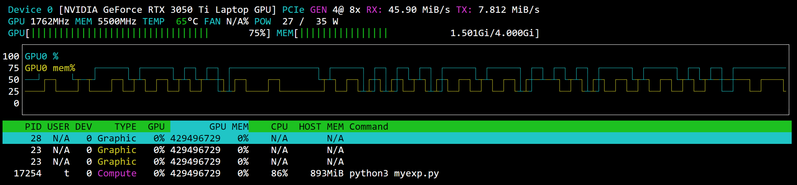
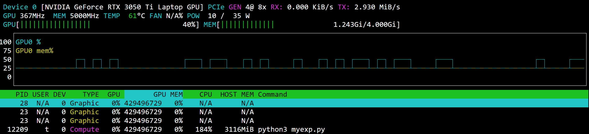
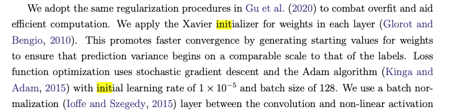

# Needle vs PyTorch

## Initialization is matter

Torch intialize Conv and Linear layers' weights according to non-linear activation function (relu vs leaky_relu). When implement the model in Needle, we did not aware that then use the only and default relu nonlinearity config. That cause the final loss of needle model always larger than torch final loss. Needle losses around 1.0, torch around 0.7, about 0.3 different.

To find out exactly which compoment of the network cause the different. We run both torch model and needle model on the same mini-batches, hyper-paramaters, and configs. We even created a PseudoDropout layer in needle to copy exactly torch Dropout layer behavior.

We run a mini-experience by training both models on 16k input images, for 5 epochs, and compare losses at the end of each epoch. In the first run, we copy needle initialized weights to torch, then the losses are exactly the same, so we are confident that our implement are correct and needle accuracy is on-par with torch.
```
loss         needle     torch          diff
epoch 0: 0.96261054 0.9625967 1.3828278e-05
epoch 1: 1.050356   1.0503557 3.5762787e-07
epoch 2: 1.1356571  1.1356555 1.5497208e-06
epoch 3: 1.0025123  1.0025071 5.2452087e-06
epoch 4: 0.7895985  0.7896045 5.9604645e-06
```

For the second run, we force needle to mimic torch dropout but don't copy needle initialized weights to torch.
```
loss         needle      torch       diff
epoch 0: 1.1341821  0.797671   0.33651108
epoch 1: 1.0557958  0.7406452  0.31515062
epoch 2: 1.1040108  0.74287474 0.36113608
epoch 3: 1.0368311  0.7846966  0.25213456
epoch 4: 0.97958153 0.762485   0.21709651
```

For the third run, we use same weight initialization, but don't force needle to mimic torch dropout. Here is the result:
```
loss        needle     torch         diff
epoch 0: 1.1006815 1.1059185 0.0052369833
epoch 1: 1.0643365 1.0856049 0.021268368
epoch 2: 1.1491817 1.1492293 0.000047564
epoch 3: 1.2083136 1.0732015 0.13511205
epoch 4: 1.1208873 1.0828264 0.038060904
```

We can conclude from 2nd run and 3rd run that the main source of different is on initialization. We scanned the torch Linear and Conv2d source code and find out that they use a different kaiming_uniform initialization paramaters for leaky_relu. We followed torch source code to initialize needle Conv and Linear layers. The final results is better training / validation losses, and similar to torch:

Final comparision: training 600k images, validating 100k images, testing 300k images, 160 images / mini-batch, 5 epoches.

```
 NEEDLE
- - - -
[ train ] Epoch: 0 Batch: 3749 Loss: 0.7249: 100%|██████████████████████████████████| 3750/3750 [54:46<00:00,  1.14it/s]
[ valid ] Epoch: 0 Batch:  624 Loss: 0.6920: 100%|██████████████████████████████████|   625/625 [02:28<00:00,  4.21it/s]
[ train ] Epoch: 1 Batch: 3749 Loss: 0.7050: 100%|██████████████████████████████████| 3750/3750 [44:33<00:00,  1.40it/s]
[ valid ] Epoch: 1 Batch:  624 Loss: 0.6936: 100%|██████████████████████████████████|   625/625 [02:34<00:00,  4.03it/s]
[ train ] Epoch: 2 Batch: 3749 Loss: 0.7001: 100%|██████████████████████████████████| 3750/3750 [53:19<00:00,  1.17it/s]
[ valid ] Epoch: 2 Batch:  624 Loss: 0.6974: 100%|██████████████████████████████████|   625/625 [02:29<00:00,  4.18it/s]
[ train ] Epoch: 3 Batch: 3749 Loss: 0.6971: 100%|██████████████████████████████████| 3750/3750 [45:02<00:00,  1.39it/s]
[ valid ] Epoch: 3 Batch:  624 Loss: 0.6909: 100%|██████████████████████████████████|   625/625 [02:29<00:00,  4.18it/s]
[ train ] Epoch: 4 Batch: 3749 Loss: 0.6956: 100%|██████████████████████████████████| 3750/3750 [44:05<00:00,  1.42it/s]
[ valid ] Epoch: 4 Batch:  624 Loss: 0.6964: 100%|██████████████████████████████████|   625/625 [02:32<00:00,  4.09it/s]
[ test ] Acc: 50.4% Loss: 0.6939: 100%|█████████████████████████████████████████████| 1875/1875 [07:23<00:00,  4.23it/s]

TORCH
- - -
[ train ] Epoch: 1 Batch: 3749 Loss: 0.7130: 100%|██████████████████████████████████| 3750/3750 [08:28<00:00,  7.37it/s]
[ valid ] Epoch: 1 Batch:  624 Loss: 0.7134: 100%|██████████████████████████████████|   625/625 [01:39<00:00,  6.28it/s]
[ train ] Epoch: 2 Batch: 3749 Loss: 0.7031: 100%|██████████████████████████████████| 3750/3750 [08:18<00:00,  7.52it/s]
[ valid ] Epoch: 2 Batch:  624 Loss: 0.7015: 100%|██████████████████████████████████|   625/625 [01:42<00:00,  6.10it/s]
[ train ] Epoch: 3 Batch: 3749 Loss: 0.6979: 100%|██████████████████████████████████| 3750/3750 [08:23<00:00,  7.45it/s]
[ valid ] Epoch: 3 Batch:  624 Loss: 0.6979: 100%|██████████████████████████████████|   625/625 [01:40<00:00,  6.20it/s]
[ train ] Epoch: 4 Batch: 3749 Loss: 0.6952: 100%|██████████████████████████████████| 3750/3750 [08:27<00:00,  7.38it/s]
[ valid ] Epoch: 4 Batch:  624 Loss: 0.6988: 100%|██████████████████████████████████|   625/625 [01:41<00:00,  6.16it/s]
[ test ] Acc: 50.9% Loss: 0.6974: 100%|█████████████████████████████████████████████| 1875/1875 [05:04<00:00,  6.16it/s]
```

## Performance and efficiency
From training logs above, we can easily see that torch training is ~6x faster than needle, and torch inference is ~1.5x faster than needle.

In term of efficiency, we noticed that needle utilize roughly double GPU power and a bit more GPU memory.

One thing to notice is that torch utilize much more CPU and RAM on host machine than needle. Torch use 184% of CPU and 3.1G of RAM, meanwhile needle use 86% of CPU and 0.9G of RAM.

We guest that, torch superior is due to it's better tensor operation implementation (matrix multiplication, convolution), better data-pilining, and better computational graph optimization for backward computation. Better graph optimization should be the main reason that lead to torch training speed is ~6x higher than needle, meanwhile inference speed is only ~1.5x.


_needle training GPU utilization_


_torch training GPU utilization_

## Benchmark needle

In-order to see which parts of needle take times, we measure timespents on each TensorOp compute() and gradient() separately while training the model:
```
[ train ] Epoch: 0 Batch: 40 Acc: 48.3% Loss: 0.7801: 41it [00:41,  1.02s/it]

compute()     CALL  x   AVG  = TIME   %
- - - - - - - - - - - - - - - - - - - -
Summation      246  0.01111  2.7331   7
LeakyReLU       82  0.02960  2.4269   6
Conv            82  0.02788  2.2863   5
EWiseAdd       861  0.00111  0.9556   2
MaxPool2d       82  0.00558  0.4576   1
BroadcastTo    451  0.00043  0.1936   0
Negate         205  0.00041  0.0833   0
PowerScalar    164  0.00037  0.0610   0
Reshape        451  0.00010  0.0444   0
EWiseMul       164  0.00023  0.0377   0
AddScalar       82  0.00037  0.0303   0
EWiseDiv        82  0.00035  0.0285   0
DivScalar      246  0.00010  0.0248   0
LogSumExp       41  0.00027  0.0109   0
MulScalar      328  0.00002  0.0055   0
Transpose      656  0.00001  0.0036   0
MatMul          41  0.00005  0.0019   0
- - - - - - - - - - - - - - - - - - - -
FORWARD                             22%


gradient()    CALL  x   AVG  = TIME   %
- - - - - - - - - - - - - - - - - - - -
Conv            82  0.12947  10.612  25
BroadcastTo    451  0.01271  5.7338  14
LeakyReLU       82  0.03149  2.5825   6
MaxPool2d       82  0.02270  1.8614   4
PowerScalar    164  0.00112  0.1833   0
MatMul          41  0.00435  0.1782   0
EWiseDiv        82  0.00188  0.1545   0
EWiseMul       164  0.00066  0.1088   0
Summation      246  0.00038  0.0930   0
Negate         205  0.00029  0.0600   0
Reshape        451  0.00010  0.0470   0
DivScalar      246  0.00011  0.0263   0
LogSumExp       41  0.00030  0.0124   0
Transpose      656  0.00001  0.0077   0
EWiseAdd       410  0.00000  0.0013   0
AddScalar       82  0.00000  0.0001   0
- - - - - - - - - - - - - - - - - - - -
BACKWARD                            52%

Total     41.7993s 100%
- - - - - - - - - - - -
Forward    9.3851s  22%
Backward  21.6666s  52%
Others    10.7476s  26%
```

As you see, 
- `52%` timespent on backward `op.gradient()`
- `22%` timespent on forward `op.compute()`
- `26%` timespent on other things

For ops, `Conv.gradient()` and `BroadcastTo.gradient()` took most of the timespent (25% and 14%), suggest that if we can optimize convolution and summation (BroadCastTo.gradient() use summation) we can increase needle speed a little bit.

We did not investigate where remain `26%` go yet, the benchmark are just to check if we did something wrong with new ops `LeakyReLU` and `MaxPool2d` that slow the whole system. We can conclude that our new ops are all good.

- - -

The original paper use Xavier initialization, I missed that part when reading the paper.


- - -

## Benchmark using other backends

```
((( USING CPU NUMPY )))
>>> optim params 10
[ train ] Epoch: 0 Batch: 40 Acc: 49.5% Loss: 0.7714: 41it [02:06,  3.09s/it]

FORWARD       CALL  x   AVG  = TIME   %
- - - - - - - - - - - - - - - - - - - -
Summation      246  0.03082  7.5805   6
Conv            82  0.07954  6.5225   5
EWiseAdd       861  0.00655  5.6390   4
LeakyReLU       82  0.05804  4.7590   4
BroadcastTo    451  0.00502  2.2622   2
Negate         205  0.00506  1.0379   1
MaxPool2d       82  0.01206  0.9889   1
PowerScalar    164  0.00596  0.9771   1
Reshape        451  0.00189  0.8543   1
EWiseMul       164  0.00489  0.8016   1
EWiseDiv        82  0.00820  0.6721   1
AddScalar       82  0.00576  0.4720   0
MatMul          41  0.01014  0.4157   0
DivScalar      246  0.00053  0.1302   0
LogSumExp       41  0.00018  0.0072   0
Transpose      656  0.00001  0.0056   0
MulScalar      328  0.00001  0.0037   0

BACKWARD      CALL  x   AVG  = TIME   %
- - - - - - - - - - - - - - - - - - - -
Conv            82  0.43345  35.5428  28
BroadcastTo    451  0.03822  17.2392  14
LeakyReLU       82  0.12176  9.9843   8
PowerScalar    164  0.03710  6.0846   5
EWiseDiv        82  0.07097  5.8194   5
MaxPool2d       82  0.06329  5.1897   4
EWiseMul       164  0.00839  1.3755   1
Negate         205  0.00455  0.9318   1
Summation      246  0.00288  0.7086   1
MatMul          41  0.01688  0.6920   1
Reshape        451  0.00112  0.5034   0
DivScalar      246  0.00083  0.2044   0
LogSumExp       41  0.00028  0.0113   0
Transpose      656  0.00001  0.0083   0
EWiseAdd       410  0.00000  0.0008   0
AddScalar       82  0.00000  0.0001   0

Total    126.4189s 100%
- - - - - - - - - - -
Forward  33.1295s  26%
Backward 84.2962s  67%
Others   8.9932s   7%
```
