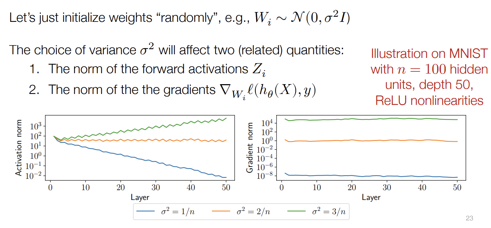

## Khởi tạo tham số https://youtu.be/CukpVt-1PA4?t=4194
Ôn lại bài trước, ta có công thức cập nhật trọng số bằng SGD
`W_i := W_i - alpha gradient_{W_i} l(h_theta(X),y)`

Vấn đề ở đây là với i = 1, ta khởi tạo trọng số của W_i, b_i như thế nào? set toàn bộ = 0?

Ôn lại công thức backprob mà không dùng bias:
- `Z_i+1 = sigma_i(W_i Z_i)`
- `G_i = (G_i+1 sigma_i'(Z_i W_i)) W_iT^`

Nếu W_i = 0 thì G_j = 0 for j <= i => gradient_{W_i} l(h_theta(X),y) = 0 => tham số không được cập nhật.
Vậy nên khởi tạo W_i = 0 là một lựa chọn vô cùng tồi.

## Key idea #1: cách khởi tạo tham số thực sự ảnh hưởng tới quá trình huấn luyện

Khởi tạo tham số ngẫu nhiên, normal distribution with mean = 0 và phương sai (covariant sigma^2) khác nhau (nếu không có cách nào khác hay hơn thì hãy cứ khởi tạo ngẫu nhiên). Khi viết `W_i = N(0, sigma^2 I)` có nghĩa là mỗi thành phần (scalar) của trọng số được lấy mẫu theo một phân bố Gaussian độc lập, với phương sai sigma^2.

Điểm quan trọng ở đây là, sự lựa chọn phương sai không phải là thứ bạn bạn có thể tùy ý lựa chọn và tất cả chúng đều hoạt động tốt. Việc lựa chọn phương sai có ý nghĩa rất lớn đối với hiệu suất và kết quả cập nhật trọng số, độ lớn của gradients tất cả những thứ khác trong NN.

Xem minh họa ở hình trên, với tập dữ liệu MNIST và mạng NN có 50 layers, và hàm kích hoạt ReLU. Chuẩn hóa của các kích hoạt (norm of Z_i term) khi chúng lan tỏa qua các layers của mạng. Và như bạn thấy với 3 giá trị khác nhau của phương sai sigma^2 lần lượt là 1/n, 2/n, và 3/n. Chúng ta thấy mỗi lựa chọn phương sai sẽ dẫn đến hiệu suất rất khác nhau hay là các loại hành vi rất khác nhau.
- Với phương sai sigma^2 = 2/n, các chuẩn kích hoạt gần như bằng nhau, gradient norm gần như bằng 1,
- Với phương sai sigma^2 = 3/n, các chuẩn kích hoạt tăng lên, và gradient cũng lớn hơn
- Với phương sai sigma^2 = 1/n, các chuẩn kích hoạt giảm xuống, và gradient cũng nhỏ đi

Lưu ý rằng với việc tối ưu hóa hàm lồi truyền thống việc khởi tạo tham số thường không có ảnh hưởng lớn như ở đây:
- 0 không hoạt động
- ngẫn nhiên chỉ hoạt động khi bạn chọn phương sai phù hợp

## Key idea #2: weights don't move "that much"

Với quá trình tối ưu hóa, bạn sẽ hình dung trong đầu các tham số của mạng sẽ hội tụ về một vùng điểm nhất định cho dù được khởi tạo như thế nào. Điều này là không đúng, trọng số có di chuyển nhưng chỉ ở rất gần điểm khởi tạo thay vì điểm tối ưu cuối.

__Kết luận cuối cùng__: khởi tạo thực sự quan trọng !!! 

Quay trở lại minh họa này, tôi muốn giải thích rằng tại sao 2/n lại là phương sai phù hợp, và làm thế nào điều này có thể motivate việc chúng ta nên khởi tạo trọng số ntn?

Ý tưởng là khi chúng ta nghĩ về các trọng số được khởi tạo ngẫu nhiên, thì hóa ra chúng ta thực sự có thể nghĩ về loại sản phẩm hoặc nghĩ về các số hạng trung gian trong một mảng theo cách lỏng lẻo, bởi vì điều này không chính xác tuyệt đối - chúng ta có thể coi chúng đại khái như một loại biến ngẫu nhiên có trung bình và phương sai nào đó. Và với bất kỳ phân phối xác suất nào, khi tính trung bình cộng tất cả chúng lại với nhau, thì trung bình đó được coi là một biến ngẫu nhiên mới, bạn biết đấy, sẽ tiệm cần Gaussian, nếu bạn có scaling phù hợp, ... 

Một cách không chính thức, hãy coi tất cả các khía cạnh trung gian trong mạng là giống như các biến ngẫu nhiên thông thường, và chúng ta muốn xem điều gì xảy ra ở đây. Vì vậy hãy nghĩ về đầu vào của mạng là x ~ N(0,1), và trọng số W ~ N(0,1/n), khi đó kỳ vọng về tích của x và W, bởi chúng là các biến ngẫu nhiên độc lập, nên `E[x_i W_i] = E[X_i]E[W_i] = 0` và vì chúng độc lập nên phương sai của tích của chúng là `Var[x_i W_i] = Var[X_i] Var[W_i] = 1 * 1/n = 1/n`. Tương tự như thế `E[W^T x] = 0` và `Var[W^T x] = 1` (W^T x -> N(0,1) bởi thuyết giới hạn trung tâm - central limit theorem). Với `W^T x = sum_i=1..n(x_i W_i)`.

Vì thế một cách không chính thức, nếu chúng ta sử dụng linear activation và với Z_i ~ N(0, I), W_i ~ N(0, 1/n I) thì `Z_i+1 = W_i^T Z_i ~ N(0, I)`. 

Nếu chúng ta sử dụng hàm kích hoạt ReLU thì một nửa của các thành phần của Z_i sẽ bị set to 0, vì thế __để duy trì sự ổn định của activation từ layer này sang layer khác__, chúng ta cần gấp đôi phương sai của W_i để có thể đạt được phương sai cuối cùng giống trường hợp kích hoạt tuyến tính (linear activation), và vì thế `W_i ~ N(0, 2/n I)` (Kaiming normal initialization). Và nó là một trong những cách khởi tạo mạng tiêu chuẩn.

## Chuẩn hóa https://youtu.be/ky7qiKyZmnE?t=742
...

